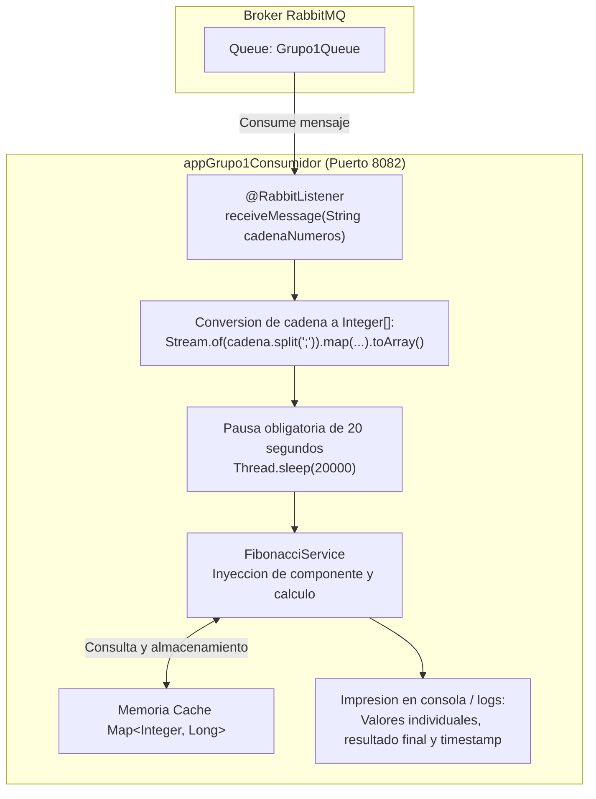

# appGrupo1Consumidor - Microservicio Consumidor RabbitMQ

Evaluacion T1 del curso **Desarrollo de Aplicaciones Web II**  
Instituto Superior Tecnologico Cibertec  
Grupo 1

---

## Integrantes del Grupo

| N° | Apellidos y Nombres | Grupo |
|:--:|---------------------|:-----:|
| 1 | Chaupis Alvarez Jhonny Samuel | 1 |
| 2 | Cruz Valdez Ronald Corwin | 1 |
| 3 | Hinojosa Cano Carlos Daniel | 1 |
| 4 | Hurtado Sernaque Brayan Luis | 1 |
| 5 | Alayo Oliveros Mathias Miller | 1 |

---

## Descripcion del Proyecto

El microservicio consumidor corresponde a la solucion de la Pregunta 4 de la Evaluacion T1. Se encarga de escuchar los mensajes publicados en la cola de RabbitMQ, convertir la cadena recibida en un arreglo de enteros, efectuar una pausa obligatoria de 20 segundos, invocar el servicio de calculo de la serie de Fibonacci con soporte de memoizacion en memoria e imprimir en consola el desglose de los resultados obtenidos con su marca de tiempo.

---

## Entorno y Requisitos Tecnicos

- **Lenguaje:** Java 25
- **Framework:** Spring Boot 4.1.1
- **Sistema de mensajeria:** RabbitMQ (protocolo AMQP 0-9-1)
- **Gestor de construccion:** Apache Maven 3.9+ (o Maven Wrapper incluido)
- **Puerto del servicio:** 8082
- **Puerto de RabbitMQ:** 5672

---

## Flujo de Procesamiento Asincrono



---

## Configuracion de RabbitMQ

Los parametros de conexion y enrutamiento en RabbitMQ son:

| Parametro | Definicion en el Examen | Valor Configurado |
|---|---|---|
| Cola (Queue) | NroGrupoQueue | Grupo1Queue |
| Intercambiador (Exchange) | NroGrupoExchange | Grupo1Exchange |
| Clave de Enrutamiento (Routing Key) | NroGrupoRouting | Grupo1Routing |
| Host del broker | spring.rabbitmq.host | localhost |
| Puerto AMQP | spring.rabbitmq.port | 5672 |

---

## Componentes Principales de la Solucion

### 1. Receptor de Mensajes (`FibonacciConsumer`)
Escucha los mensajes entrantes de la cola mediante la anotacion `@RabbitListener`:
```java
@RabbitListener(queues = "Grupo1Queue")
public void receiveMessage(String cadenaNumeros) {
    // Procesamiento del mensaje
}
```

### 2. Conversion de la Cadena a `Integer[]`
Se procesa la cadena delimitada por punto y coma utilizando la API Stream de Java:
```java
Integer[] integerArray = Stream.of(cadenaNumeros.split(";"))
                               .map(String::trim)
                               .filter(s -> !s.isEmpty())
                               .map(Integer::parseInt)
                               .toArray(Integer[]::new);
```

### 3. Pausa Obligatoria de 20 Segundos
Se suspende la ejecucion del hilo de procesamiento durante 20 segundos (`20000` milisegundos) antes de ejecutar el algoritmo:
```java
try {
    Thread.sleep(20000);
} catch (InterruptedException e) {
    Thread.currentThread().interrupt();
    log.error("Error en la pausa de ejecucion", e);
}
```

### 4. Servicio de Calculo con Memoizacion (`FibonacciService`)
El servicio implementa el calculo de los terminos de la serie de Fibonacci empleando una coleccion `Map<Integer, Long>` como cache en memoria para evitar el costo computacional de subproblemas repetidos:
```java
@Service
public class FibonacciService {
    private final Map<Integer, Long> cache = new HashMap<>();

    public long fibonacci(int n) {
        if (n <= 1) return n;
        if (cache.containsKey(n)) return cache.get(n);

        long result = fibonacci(n - 1) + fibonacci(n - 2);
        cache.put(n, result);
        return result;
    }

    public List<Long> calculateSequence(List<Integer> positions) {
        return positions.stream()
                .map(this::fibonacci)
                .collect(Collectors.toList());
    }
}
```

---

## Salida Esperada en Consola

Al recibir como mensaje la cadena de ejemplo `1;2;15;8`, el consumidor genera la siguiente salida en consola:

```text
INFO  [consumer] : Mensaje recibido de RabbitMQ: 1;2;15;8
... [espera de 20 segundos] ...
INFO  [consumer] : fibonacci(1) = 1
INFO  [consumer] : fibonacci(2) = 1
INFO  [consumer] : fibonacci(15) = 610
INFO  [consumer] : fibonacci(8) = 21
INFO  [consumer] : Resultado: [1, 1, 610, 21]
INFO  [consumer] : Procesado, fecha y hora 2026-09-27T01:04:30
----------------------------------------
```

---

## Compilacion y Ejecucion

### Prerrequisitos

- Servidor **RabbitMQ** en ejecucion en el puerto `5672`.
- Microservicio `appGrupo1Productor` configurado para emitir mensajes.

### Pasos de Ejecucion

1. Clonar el repositorio:
```bash
git clone https://github.com/samuelchaupis-cloud/appGrupo1Consumidor.git
cd appGrupo1Consumidor
```

2. Compilar con Maven Wrapper:
- En entornos Unix (Linux / macOS):
```bash
./mvnw clean compile
```
- En entornos Windows:
```cmd
mvnw.cmd clean compile
```

3. Iniciar el servicio consumidor:
- En entornos Unix (Linux / macOS):
```bash
./mvnw spring-boot:run
```
- En entornos Windows:
```cmd
mvnw.cmd spring-boot:run
```

El servicio iniciara en el puerto `8082` y quedara a la espera de mensajes de la cola `Grupo1Queue`.

---

## Estructura de Ramas

El repositorio organiza el trabajo en las siguientes ramas:

- `main`: Rama principal con la version final y funcional del microservicio consumidor.
- `develop`: Rama de integracion para consolidar modificaciones antes del pase a `main`.
- Ramas por integrante:
  - `samuel`: Rama de trabajo de Jhonny Samuel Chaupis Alvarez.
  - `jhonny-chaupis`: Alias nominal para identificacion de integrante.
  - `ronald-cruz`: Rama de trabajo de Ronald Corwin Cruz Valdez.
  - `daniel-hinojosa`: Rama de trabajo de Carlos Daniel Hinojosa Cano.
  - `brayan-hurtado`: Rama de trabajo de Brayan Luis Hurtado Sernaque.
  - `mathias-alayo`: Rama de trabajo de Mathias Miller Alayo Oliveros.
  - `jmalayo`: Rama base del repositorio colegiado.
