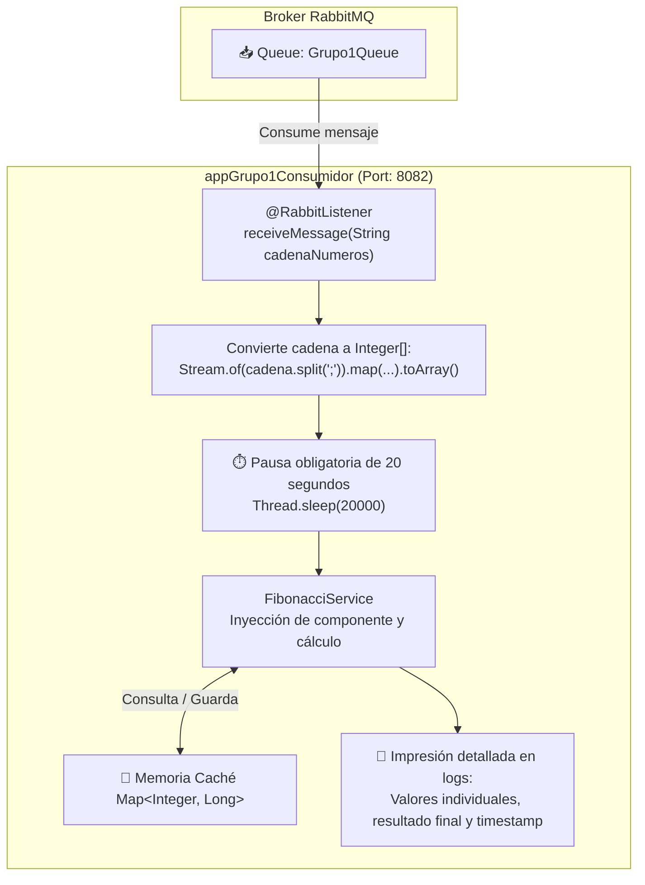

# 📥 appGrupo1Consumidor — Microservicio Consumidor RabbitMQ (Pregunta 4)

[](https://openjdk.org/)
[](https://spring.io/projects/spring-boot)
[](https://www.rabbitmq.com/)
[](https://en.wikipedia.org/wiki/Fibonacci_sequence)
[](http://localhost:8082)

Microservicio **Consumidor** desarrollado para la **Pregunta 4** de la **Evaluación T1** del curso **Desarrollo de Aplicaciones Web II** (Cibertec - Grupo 1).  
Escucha mensajes asíncronos desde **RabbitMQ**, deserializa la secuencia de posiciones numéricas, aplica una pausa de 20 segundos según la rúbrica y calcula los valores de Fibonacci correspondientes utilizando un algoritmo optimizado con caché en memoria.

---

## 📐 Flujo de Procesamiento Asíncrono



---

## ⚙️ Configuración y Componentes Clave

### 1. Configuración de RabbitMQ
* **Queue:** `Grupo1Queue`
* **Exchange:** `Grupo1Exchange`
* **Routing Key:** `Grupo1Routing`

### 2. Conversión del Mensaje
Tal como lo solicita el examen:
```java
Integer[] integerArray = Stream.of(cadenaNumeros.split(";"))
                               .map(String::trim)
                               .filter(s -> !s.isEmpty())
                               .map(Integer::parseInt)
                               .toArray(Integer[]::new);
```

### 3. Servicio de Fibonacci con Memoización (`FibonacciService`)
Optimización mediante caché para evitar recálculos exponenciales:
```java
@Service
public class FibonacciService {
    private final Map<Integer, Long> cache = new HashMap<>();

    public long fibonacci(int n) {
        if (n <= 1) return n;
        if (cache.containsKey(n)) return cache.get(n);

        long result = fibonacci(n - 1) + fibonacci(n - 2);
        cache.put(n, result);
        return result;
    }

    public List<Long> calculateSequence(List<Integer> positions) {
        return positions.stream()
                .map(this::fibonacci)
                .collect(Collectors.toList());
    }
}
```

### 4. Pausa de 20 Segundos e Impresión de Resultados
El consumidor ejecuta `Thread.sleep(20000)` antes de procesar el cálculo, e imprime en consola mediante `Slf4j` el resultado por cada posición y el consolidado con fecha y hora.

---

## 🚀 Puesta en Marcha

### Prerrequisitos
* Tener el broker **RabbitMQ** corriendo en `localhost:5672`.
* Microservicio `appGrupo1Productor` levantado o listo para enviar mensajes.

### Ejecución del Consumidor
```bash
# 1. Clonar el repositorio
git clone https://github.com/samuelchaupis-cloud/appGrupo1Consumidor.git
cd appGrupo1Consumidor

# 2. Compilar y arrancar
./mvnw clean compile
./mvnw spring-boot:run
```
El microservicio quedará a la espera de mensajes en el puerto **`8082`**.

---

## 🖥️ Evidencia en Consola / Salida de Ejemplo

Cuando el Productor envía `1;2;15;8`, el Consumidor muestra la siguiente traza:
```text
INFO  [consumer] : Mensaje recibido de RabbitMQ: 1;2;15;8
... [espera de 20 segundos] ...
INFO  [consumer] : fibonacci(1) = 1
INFO  [consumer] : fibonacci(2) = 1
INFO  [consumer] : fibonacci(15) = 610
INFO  [consumer] : fibonacci(8) = 21
INFO  [consumer] : Resultado: [1, 1, 610, 21]
INFO  [consumer] : Procesado, fecha y hora 2026-09-27T01:04:30
----------------------------------------
```

---

## 🌿 Organización de Ramas de Git

* **`main`**: Rama con la versión final probada del consumidor.
* **`develop`**: Integración con el productor y RabbitMQ.
* **Ramas por integrante**: `samuel`, `jmalayo`, `daniel`, etc., con control de Pull Requests y revisiones de código.

---

## 👥 Equipo de Desarrollo (Grupo 1)
* **Samuel Chaupis** — Implementación del Consumidor AMQP, Servicio Fibonacci y Pausa de 20s.
* **J. Malayo** — Verificación de colas y contratos de mensajería.
* **Integrantes Grupo 1** — Pruebas de integración extremo a extremo con RabbitMQ.
